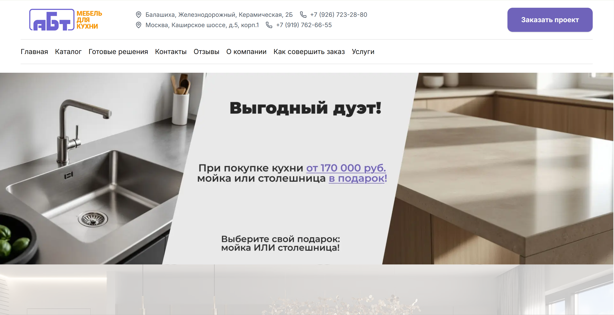
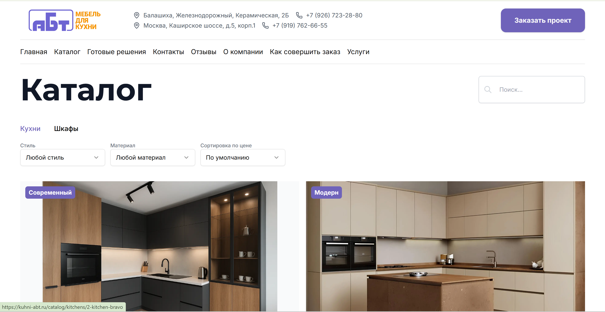
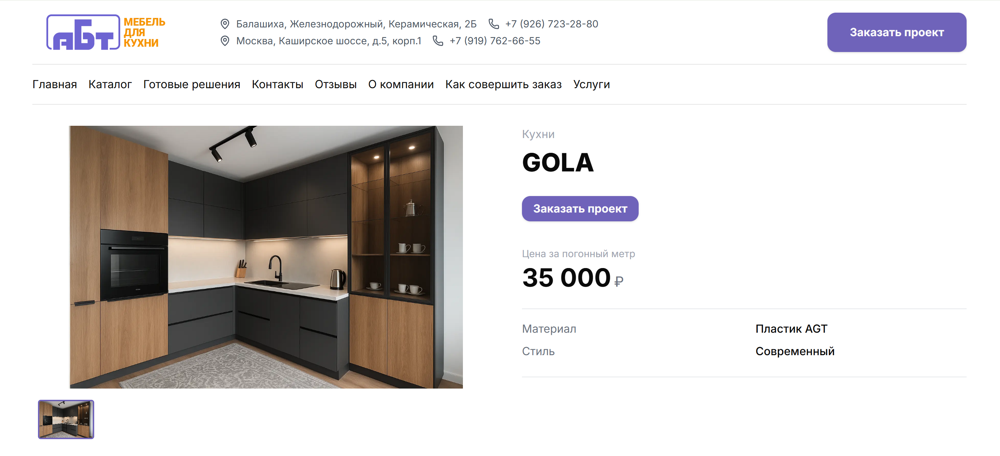
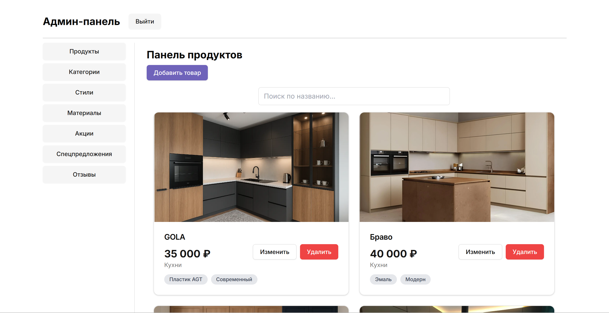

# Кухни АБТ

## 1. Название проекта

**Кухни АБТ**

## 2. Краткое описание

**Кухни АБТ** — fullstack-приложение для мебельной компании: публичный сайт-каталог, витрина акций, форма заявок и
закрытая админ-панель для управления контентом.

С точки зрения пользователя это сайт, где можно:

- посмотреть категории и готовые решения;
- открыть карточку товара с фотографиями и описанием;
- отфильтровать каталог по стилю и материалу;
- оставить заявку на расчет или консультацию;
- ознакомиться с отзывами, услугами и актуальными акциями.

С точки зрения бизнеса проект решает две задачи:

- дает клиенту удобный канал знакомства с ассортиментом и отправки заявки;
- позволяет команде без правок кода управлять каталогом, промо-блоками, отзывами и медиа.

## 3. Основные возможности

- Публичный каталог мебели с категориями, карточками товаров и SEO-friendly маршрутами.
- Раздел акций и готовых предложений с отдельными страницами и собственной моделью данных.
- Фильтрация товаров и акционных позиций по категории, стилю и материалу.
- Карточки товаров и акций с галереями изображений, ценой и описанием.
- Формы обратной связи и заявок с сохранением в базе и отправкой email-уведомления менеджеру.
- Раздел отзывов с рейтингом, фотографиями и управлением из админ-интерфейса.
- Защищенная админ-панель с авторизацией по токену для CRUD-операций над каталогом и контентом.
- Production-окружение через Docker Compose с `Nginx`, `PostgreSQL`, `Next.js`, `Django` и SSL через `certbot`.

## 4. Скриншоты

### Главная страница


### Каталог


### Страница товара


### Админ-панель


## 5. Архитектура

Проект разделен на два независимых приложения:

- `abt-frontend` — клиентская часть на `Next.js 15` для публичного сайта и административного интерфейса;
- `furniture_catalog` — backend на `Django + DRF`, который отдает API, хранит бизнес-данные и обрабатывает заявки.

Дополнительно используются:

- `PostgreSQL` как основная БД;
- `Nginx` как reverse proxy и точка входа в production;
- `Yandex Object Storage` для хранения медиафайлов;
- `certbot` для TLS-сертификатов.

### Схема взаимодействия

```text
Browser
   |
   v
Next.js Frontend
   |
   v
Django REST API
   |
   v
PostgreSQL

Media upload/delete -> Yandex Object Storage
HTTPS / reverse proxy -> Nginx + Certbot
```

## 6. Технологии

### Frontend

- `Next.js 15` (`App Router`, `standalone build`)
- `React 19`
- `TypeScript`
- `Tailwind CSS`
- `Radix UI`
- `React Query`
- `Axios`
- `Framer Motion`
- `Embla Carousel`
- `js-cookie`

### Backend

- `Django 5`
- `Django REST Framework`
- `django-rest-knox`
- `django-cors-headers`
- `djangorestframework-camel-case`
- `Daphne`
- `boto3`
- `python-decouple`

### Database

- `PostgreSQL 15`
- `SQLite` в репозитории присутствует как локальный артефакт/данные, но production-конфигурация настроена на
  `PostgreSQL`

### DevOps

- `Docker`
- `Docker Compose`
- `Nginx`
- `Certbot`

## 7. Структура проекта

```text
abt_furniture/
|- abt-frontend/                 # Next.js-приложение: публичный сайт и админка
|  |- src/app/                   # Маршруты App Router
|  |  |- (site)/                 # Публичные страницы
|  |  |- (admin)/                # Админские страницы и авторизация
|  |  `- api/                    # Вспомогательные API routes frontend
|  |- src/components/            # UI, shared, site и admin компоненты
|  |- src/actions/               # Server Actions для форм и запросов
|  |- src/lib/                   # API-клиенты, axios, утилиты
|  |- src/context/               # Контекст авторизации
|  `- public/                    # Статические ресурсы
|- furniture_catalog/            # Django backend
|  |- catalog/                   # Доменные модели, serializers, views, tests
|  |- furniture_catalog/         # settings, urls, asgi, wsgi
|  |- services/                  # Интеграция с Yandex Object Storage
|  |- manage.py
|  `- requirements.txt
|- docker-compose.yml            # Production-like orchestration
|- nginx.conf                    # Reverse proxy, HTTPS, API routing
`- README.md
```

## 8. Запуск проекта

### Вариант 1. Docker Compose

Подходит для запуска всей системы целиком: frontend, backend, БД и reverse proxy.

1. Создайте файл `furniture_catalog/.env` на основе примера из раздела ниже.
2. При необходимости создайте `abt-frontend/.env`.
3. Из корня проекта запустите:

```bash
docker compose up --build
```

4. После старта сервисы будут доступны так:

- frontend: `http://localhost`
- backend healthcheck: `http://localhost/api/health/`
- админка frontend: `http://localhost/auth/login`

Если нужен HTTPS в production, проект уже содержит связку `Nginx + certbot` и конфигурацию для домена `kuhni-abt.ru`.

### Вариант 2. Локальный запуск без Docker

#### Backend

1. Перейдите в backend:

```bash
cd furniture_catalog
```

2. Создайте виртуальное окружение и установите зависимости:

```bash
python -m venv .venv
.venv\Scripts\activate
pip install -r requirements.txt
```

3. Создайте `.env`.

4. Примените миграции:

```bash
python manage.py migrate
```

5. Создайте администратора:

```bash
python manage.py createsuperuser
```

6. Запустите backend:

```bash
python manage.py runserver 0.0.0.0:8000
```

#### Frontend

1. Перейдите во frontend:

```bash
cd abt-frontend
```

2. Установите зависимости:

```bash
npm ci
```

3. Создайте `.env.local`.

4. Запустите dev-сервер:

```bash
npm run dev
```

5. Откройте приложение:

- сайт: `http://localhost:3000`
- login админки: `http://localhost:3000/auth/login`

## 9. Переменные окружения

### Backend: `furniture_catalog/.env`

```env
SECRET_KEY=change-me
POSTGRES_DB=furniture_catalog
POSTGRES_USER=user_abt
POSTGRES_PASSWORD=strong_password
DB_HOST=db
DB_PORT=5432

YANDEX_STORAGE_ENDPOINT=https://storage.yandexcloud.net
YANDEX_STORAGE_BUCKET=abt-furniture-media
YANDEX_ACCESS_KEY=your_access_key
YANDEX_SECRET_KEY=your_secret_key

EMAIL_HOST_USER=info@example.com
EMAIL_PASSWORD=your_email_password
DEFAULT_FROM_EMAIL=info@example.com
```

Для локального запуска без Docker можно заменить `DB_HOST=db` на `DB_HOST=127.0.0.1`.

### Frontend: `abt-frontend/.env.local`

```env
NEXT_PUBLIC_API_URL=http://localhost:8000/api
API_URL=http://localhost:8000/api
NEXT_PUBLIC_DOMAIN=http://localhost:3000
```

Для Docker-сборки frontend в compose уже используется `NEXT_PUBLIC_API_URL=/api`, а server-side запросы могут идти через
`API_URL=http://backend:8000/api`.

## 10. Описание базы данных

Основные сущности:

- `Category` — категория мебели, содержит название, slug и обложку.
- `Style` — стилистика мебели для фильтрации каталога.
- `Material` — материал изделия для фильтрации и классификации.
- `Photo` — универсальная сущность изображения, переиспользуется товарами, акциями и отзывами.
- `Product` — основной товар каталога: название, slug, цена, описание, категория, материал, стиль, набор фотографий.
- `Promotion` — акционное предложение или готовое решение с отдельной ценой, размером и галереей.
- `Review` — клиентский отзыв с рейтингом, локацией, датой и фотографиями.
- `ContactRequest` — заявка пользователя: имя, телефон, email, комментарий, интересующий товар и согласие на обработку
  данных.

### Связи

```text
Category 1 -> N Product
Category 1 -> N Promotion
Style 1 -> N Product
Style 1 -> N Promotion
Material 1 -> N Product
Material 1 -> N Promotion
Product N -> M Photo
Promotion N -> M Photo
Review N -> M Photo
```

## 11. Основные API endpoints

### Публичные

- `GET /api/categories/` — список категорий.
- `GET /api/products/?category=<slug>&style=<style>&material=<material>` — каталог с фильтрацией.
- `GET /api/promotions/` — список акционных предложений.
- `GET /api/materials/` — список материалов.
- `GET /api/styles/` — список стилей.
- `GET /api/reviews/` — отзывы.
- `POST /api/contact/` — отправка заявки.
- `GET /api/health/` — healthcheck backend.

### Авторизация и админка

- `POST /api/auth/login/` — получение Knox-токена.
- `POST /api/auth/logout/` — logout.
- `GET /api/auth/user/` — данные текущего пользователя.
- `POST|PUT|PATCH|DELETE /api/categories/`, `/api/products/`, `/api/promotions/`, `/api/reviews/`, `/api/materials/`,
  `/api/styles/` — CRUD для авторизованного администратора.

## 12. Пользовательские сценарии

### Клиент сайта

1. Открывает главную страницу и видит приветственный блок, преимущества, категории и форму обратной связи.
2. Переходит в каталог и фильтрует мебель по категории, материалу и стилю.
3. Открывает карточку товара, просматривает фотографии и описание.
4. Оставляет заявку на консультацию или расчет через форму.
5. Получает обратную связь от менеджера, а заявка сохраняется в системе.

### Контент-менеджер или администратор

1. Авторизуется в административной части через `/auth/login`.
2. Создает или редактирует категории, товары, акции, материалы, стили и отзывы.
3. Загружает изображения, которые отправляются в `Yandex Object Storage`.
4. Обновляет контент сайта без релиза frontend/backend.
5. Использует единый API и защищенные CRUD-эндпоинты для управления витриной.

## 13. Особенности реализации

- **Разделение ответственности по приложениям.** Frontend и backend изолированы и могут развиваться независимо.
- **Единая доменная модель каталога.** Товары, акции и отзывы используют общую сущность `Photo`, что упрощает работу с
  медиа.
- **Медиа вынесены во внешнее хранилище.** Файлы не копятся внутри контейнеров и не привязаны к файловой системе
  сервера.
- **API ориентирован на frontend.** Используется `camelCase` в JSON через `djangorestframework-camel-case`, что упрощает
  интеграцию с React/TypeScript.
- **Токенная авторизация для админки.** Вход выполняется через `Knox`, токен хранится в cookie, а frontend middleware
  защищает маршруты `/admin`.
- **Production-first инфраструктура.** В репозитории сразу есть контейнеризация, reverse proxy, SSL-слой и healthcheck
  endpoint.
- **SEO-подход на frontend.** Есть `metadata`, `sitemap.xml`, семантические маршруты и отдельные страницы под категории,
  товары и акции.
- **Формы заявок не ограничиваются сохранением в БД.** После создания заявки backend формирует и отправляет email
  менеджеру, включая вложенные изображения из формы.

## 14. Планы по развитию

- Добавить роли и разграничение прав для нескольких типов сотрудников.
- Вынести заявки в отдельный CRM-like раздел админки с просмотром и сменой статусов.
- Добавить пагинацию и расширенную сортировку каталога.
- Поддержать черновики и публикацию контента через флаг активности.
- Расширить набор автотестов для API, форм и критичных пользовательских сценариев.
- Подключить observability: централизованные логи, error tracking, метрики.

## 15. Автор

**Автор:** `Перминов Никита Ильич`
`Fullstack Developer`
